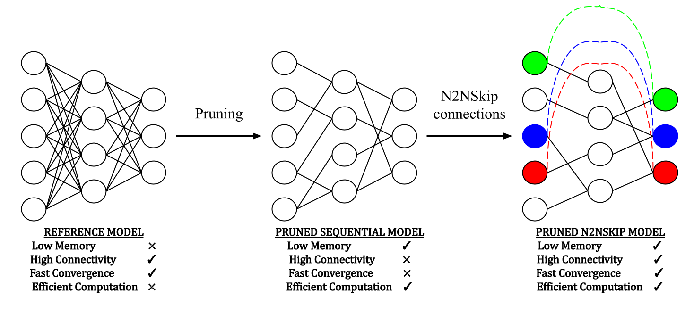
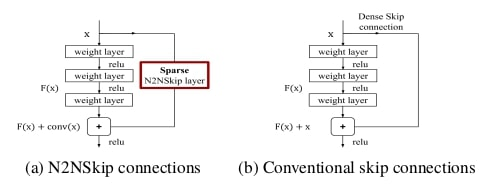
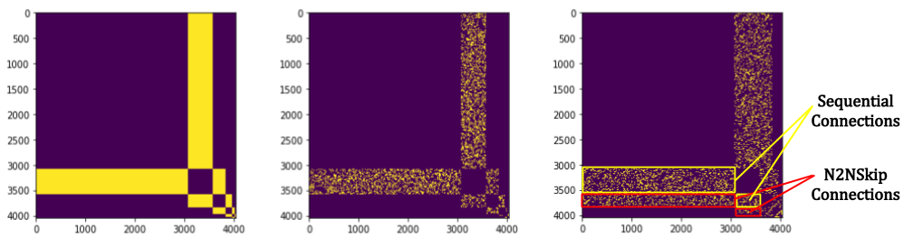

# N2NSkip: Learning Highly Sparse Networks using neuron-to-neuron skip connections (BMVC 2020)

# Introduction
In this work, we propose neuron-
to-neuron skip (N2NSkip) connections, which act as sparse weighted skip connections,
to enhance the overall connectivity of pruned DNNs. Following a preliminary pruning
step, N2NSkip connections are randomly added between individual neurons/channels of
the pruned network, while maintaining the overall sparsity of the network.

  

As opposed to conventional skip connections, N2NSkip connections act as skip
connections between non-consecutive layers of the network, and are parametrized by sparse
learnable weights. A formal representation of N2NSkip connections is illustrated below, 
where the proposed N2NSkip connections can be visualized as sparse convolutional
layers, as opposed to ResNet-like skip connections.

  

# Analyzing Connectivity in Pruned Deep Neural Networks through Heat Diffusion
We propose a heat diffusion-based connectivity measure to compare the overall con-
nectivity of pruned networks with respect to the reference network. Considering each network as
an acyclic undirected graph, we construct an n × n adjacency matrix, where n is the total number of
neurons in the MLP.

  

We empirically demonstrate that N2NSkip connections significantly lower performance
degradation as compared to conventional skip connections, resulting in consistently
superior test performance at high compression ratios.

The code for our paper is currently "under construction". We will post the link to our paper as soon as it is published online. Stay tuned for updates!
