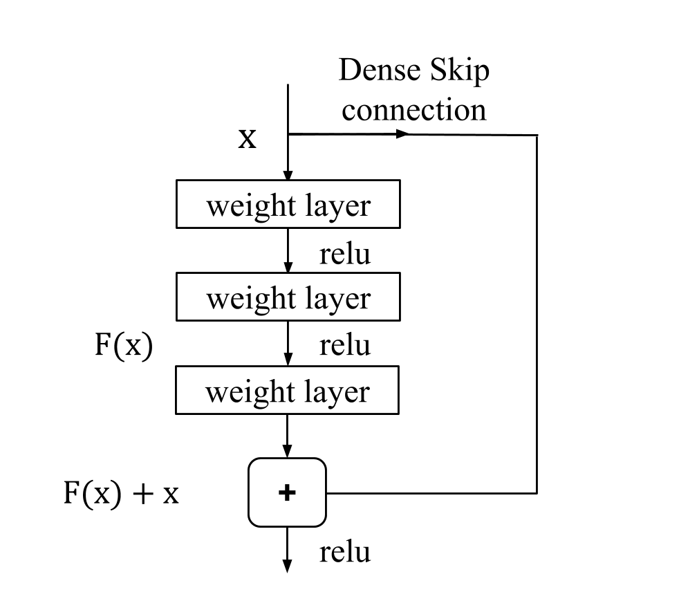
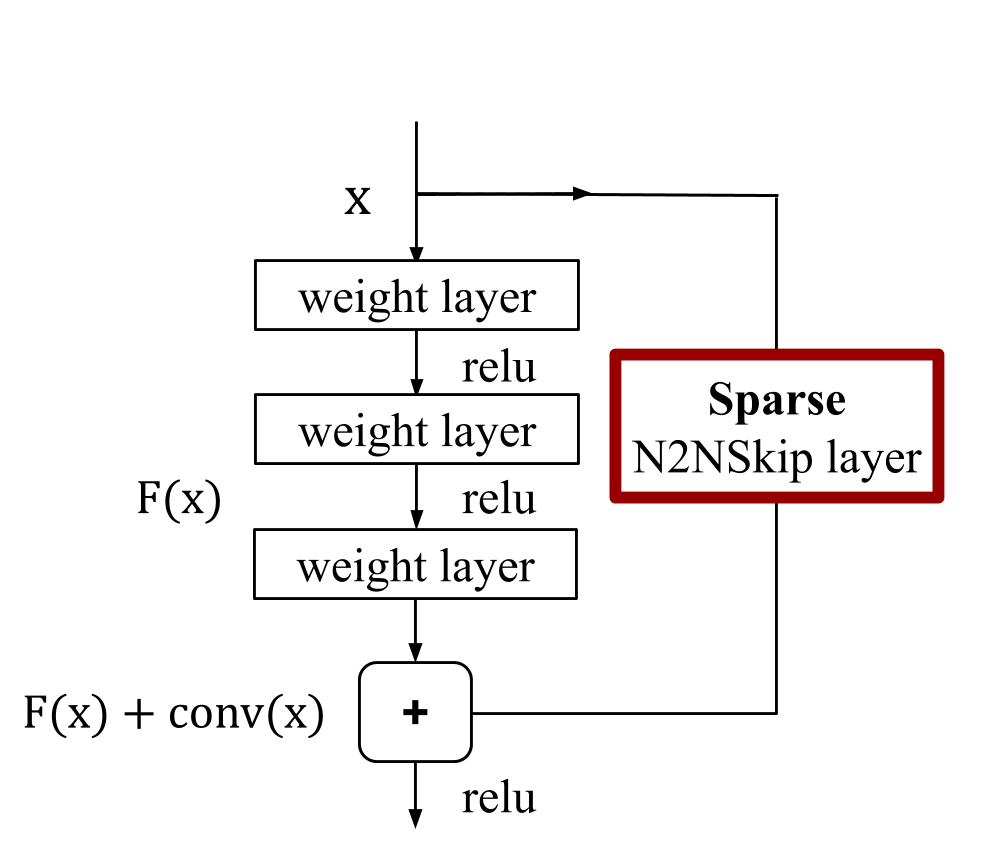

# N2NSkip: Learning Highly Sparse Networks using neuron-to-neuron skip connections (BMVC 2020)

# Introduction
In this work, we propose neuron-
to-neuron skip (N2NSkip) connections, which act as sparse weighted skip connections,
to enhance the overall connectivity of pruned DNNs. Following a preliminary pruning
step, N2NSkip connections are randomly added between individual neurons/channels of
the pruned network, while maintaining the overall sparsity of the network.

  

As opposed to conventional skip connections, N2NSkip connections act as skip
connections between non-consecutive layers of the network, and are parametrized by sparse
learnable weights. A formal representation of N2NSkip connections is illustrated below, 
where the proposed N2NSkip connections can be visualized as sparse convolutional
layers, as opposed to ResNet-like skip connections.

         
        
 

The code for our paper is currently "under construction". We will post the link to our paper as soon as it is published online. Stay tuned for updates!
